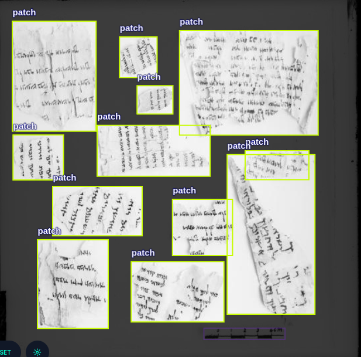

# Yam Hamelach - Kumeran scripts: matching pieces

## A. Train YOLO model to detect pieces.

# Install
Download repository, create your python3-venv, and install requirements by:\
```pip3 install -r requirements.txt```

* Label data with your favorite tool (ROBOFLOW?) for pieces object detection, and download in YOLOv8 format


* open ```train.py``` file and update ```save_dir```, ```data_path```, ```cp``` pathes.
* run ```python3 train.py```

### B. generate patches.
run

```python bounding_box_generator.py --im_path <path_to_database> --out_path <path for outputs>```\
this will generate: 
    a -  In path_for_outputs\bounding_boxes - all source images with bounding boxes and identifier index
    b -  In path_for_outputs\patches - all patches crops


### C. Run naive classifier and Ground-truth classifier, to generate true/false dataset
Naive classifier will produce candidates for match. 
Receiving All patches, and a list of true-pairs.
Naive classifier makes a very naive match decision (like: is there at least 4 features matches)\
, and then compare to Ground True.\
By this generate a list of True/False pairs for learning.
It saves: 
A - images of true/false pairs
B - lists of true/false piece names.

```python prepare_match_dataset.py --csv_fn <csv with ground true> --pairs_out <out path for matched pairs> --patches <base_path_for_prepared_patches>```

### D. Extract Features for DL model for True/False matches

```python feature_extractor.py --patches <pathces path? --pairs_path <pairs path> --features_path <path to save features>```

### E. Train NN classifier for match/no-mathc between pieces

```python3 feature_model.py```
### F. Run Matches on the whole pieces dataset.
``` python3 PAM_matcher --patches
<pre prepaired pathces> --csv_fn <csv used for true/false labeling>
--matches <path for output matches>```

